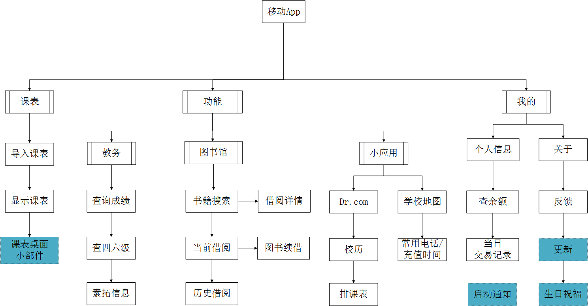

# 小广财 App

>**2019-09-22 说明：** app由于用户少，难维护，属于事实下线状态，请使用小程序

源于毕设，基于开源。产品截图见 [官网](http://www.wegdufe.com/)

App对接了广财的教务、信息门户、一卡通、图书馆等系统，包含 Dr.com 功能，数据均为爬取获取，无学校官方接口。
这个项目是客户端源码，服务端代码 [戳这](https://github.com/WeGdufe/SmallGdufe-Server)，[服务端Api接口](http://www.wegdufe.com/apidoc/)  。

图为v1.0.0的功能，很久没更新了。图中蓝色部分为入口较深的功能，启动通知为打开App时，服务端发送的通知；生日祝福是在公历生日当日打开App有弹窗祝福。

如需导入项目，**强烈推荐**  先看下 [客户端-安装指南.md ](%E5%AE%A2%E6%88%B7%E7%AB%AF-%E5%AE%89%E8%A3%85%E6%8C%87%E5%8D%97.md)  

## API接口
向对应接口发请求即可获得数据  [API文档地址](http://www.wegdufe.com/apidoc/)  
另外建议长期使用Api接口的联系下管理员，因未来会修改接口的身份、安全验证，方便到时通知。

## 广告
1. 长期招聘维护 小广财 的技术人员。
2. 如有针对广财的产品，打算发布到该 [WeGdufe](https://github.com/WeGdufe/) organization，可在 [organization页](https://github.com/WeGdufe) 点右侧头像发email给组织成员，目前找 [wintercoder](https://github.com/wintercoder) 即可。

## 技术说明
技术框架： Rxjava 2.0.1、Retrofit 2.1.0、LitePal 1.5.1 [框架学习教程戳这](学习教程.txt)

	逻辑根目录/
	├─activity          活动页面
	├─adapter           数据和列表的中介-适配器
	├─api               与服务端的接口交接部分
	├─fragment          Tab页面碎片
	├─model             服务端返回的数据封装实体
	├─util              工具包
	│  └─drcom              城市热点模块
	│  └─widget             桌面小部件相关
	└─widget            自定义控件，如课表页、可缩放的ImageView
	页面视图根目录/
	├─drawable          颜色/样式选择器
	│  └─sehedule           课表页面的颜色形状表
	├─layout            布局文件
	├─menu              标题栏的按钮页面
	├─mipmap-hdpi       针对不同手机分辨率的图片资源，下同
	├─mipmap-mdpi
	├─mipmap-xhdpi
	├─mipmap-xxhdpi
	├─mipmap-xxxhdpi
	└─values            字符串、颜色等常量

## 贡献代码
建议提交到 `dev` 分支，非 `master` ，这样我好评审代码正确性。 教程可见 [网友博文](http://www.cnblogs.com/schaepher/p/4933873.html)

贡献流程：

- `Fork`  该项目， `clone` 到本地，使用  ` git checkout dev`  切换到 `dev` 分支，如果没有就 `git checkout -b dev origin/dev` 
- 修改代码，改好 `commit` 后 `git push origin dev`  到你仓库的`dev` 分支，然后在Github页面上发起 `Pull request`  提交给该项目的 `dev` 分支。

如果想加入团队长期维护，通过Q群 `631036490` 或发邮件至 `movinggdufe@163.com` 等各种渠道联系项目管理员，将加你到组织成员里。  

近期功能需求：  
1. **功能页面 H5化**，功能页请求接口，动态下发入口，每个功能都是H5页面，方便安卓iOS同步更新、减少更新APP频率、同时能限时开发一键评教。接口不通或者断网情况注意下Drcom入口得开放
光光尝试过，但弃疗，不适合做前端，后续有熟悉前端的人的话，建议优先做这个。

1. 编辑课表界面提供时间选框。
1. 美化登陆界面、排课表、校历、地图、常用电话等界面。 
1. 图书馆Top100热门书 (小程序和后台接口已开发完，客户端未开发）
1. API接口密码字段加密，增加`Apikey`字段，限制可用的客户端。
1. 失物招领 + 认领推送，A拿到了B的东西，就对B进行APP通知推送 (小程序开发过，内容发布审核不过)   
1. ~~iPhone端。~~(2018-02-15 已完成，https://itunes.apple.com/cn/app/%E5%B0%8F%E5%B9%BF%E8%B4%A2/id1346521270?mt=8 

长远需求：  
1. 教师端 & 与老师的IM交流：我校分校区真是坑，在引入老师、学校管理员角色后增加校园咨询功能，让学生和老师能够进行线上沟通，学生也可以选择发短信给老师（经过服务器发送，不在客户端显示老师号码），短信价格由学生支付。老师可以选择单发和群发短信给指定班级的同学做通知，通知可为App、公众号、短信推送。 
1. 实名社交聊天区，必须实名，如需匿名则提示用户后台可见实名信息，提供校区选择功能。 
1. 讲座、社团活动信息，增加信息个性化推送、活动信息关注功能，如给缺少创新创业素质拓展分的学生主动推送创新创业类活动。

## 更新记录

- 2017年4月12日22:49 v1.0.0 实现大多数功能  
- 2017年4月18日12:55 v1.1.0 更改app中服务器地址的子域名为app，增加课表桌面控件、每日提醒、生日祝福  
- 2017年4月19日23:25 v1.2.0 增加课表按周查看，修复默认首页、Dr.com注销功能Bug，增加服务端注销  
- 2017年5月31日22:13 v1.3.0 新增课表编辑、查平时成绩、校友体验、排课表放在课表页功能，更换地图  
- 2017年7月16日21:02 v1.3.1 新增搜书分页查询、辅修成绩查询、按学年计算GPA，修复0.5学分显示为0分BUG和单双周课表BUG
- 2017年9月09日00:55 v1.4.0 更名小广财（原移动广财），实现电控查询、App分享微信，美化桌面控件，请求增加版本号字段方便后续分析流量，修复Bug：成绩页挂科标题乱红、课表无法切回第9周
- 2018年2月04日21:15 v1.5.0 增加提速账号Dr.com专用通道，点击关于页面版本号触发内测
- 2018年2月14日11:19 [iOS版](https://itunes.apple.com/cn/app/%E5%B0%8F%E5%B9%BF%E8%B4%A2/id1346521270?mt=8) 发布
- 2019年 app版由于用户少，难维护，基本下线，请使用小程序

## For 其他学校

各系统情况：  
- 教务系统： 湖南强智科技 http://jwxt.gdufe.edu.cn/jsxsd/    
- 图书系统：  江苏汇文 http://opac.library.gdufe.edu.cn/opac/search.php  
- 信息门户： 江苏金智教育 http://my.gdufe.edu.cn/  

对于Dr.com哆点登陆可见该分离后的项目：https://github.com/wintercoder/Gdufe-Drcom-Android

## License
[GPL V3](LICENSE)  

若你用该软件或者API接口开发了其他产品且发布使用，那么你也需要开源你的产品。  
未经允许，不得使用小广财或本软件贡献者名称为你的产品做宣传、推广等。 
